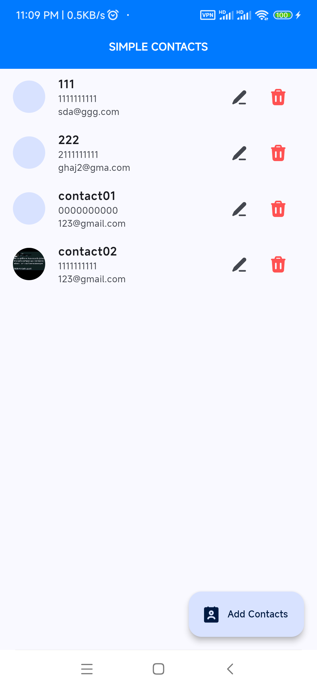
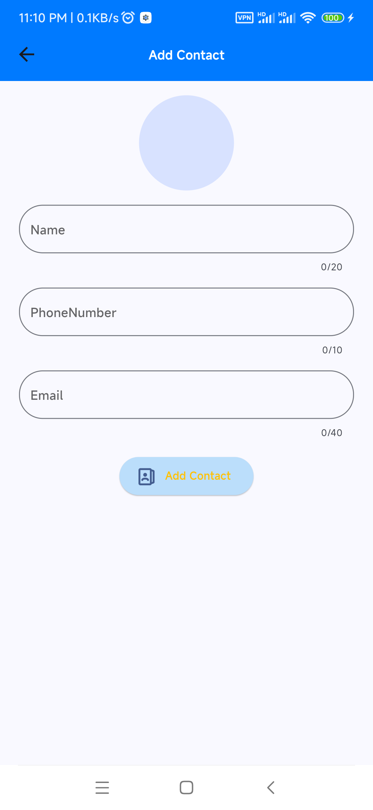
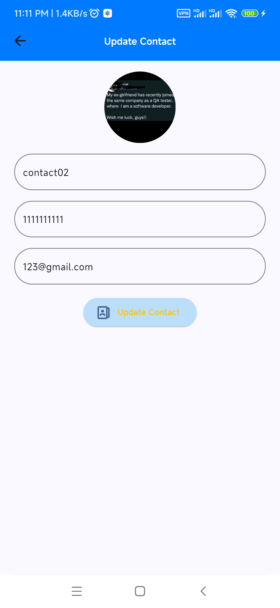

# simple_contacts
# Simple Contacts App

This simple contact app was created to demonstrate the integration of Firebase Firestore and Storage. It allows users to add, edit, and delete contacts, and upload profile pictures for each contact.

## Features

- Add new contacts with name, phone number, and email.
- Edit existing contact details.
- Delete contacts.
- Upload profile pictures for each contact.

## Getting Started

1. Clone or download this repository.
2. Install the required dependencies 
3. Create a Firebase project and enable Firestore and Storage.
4. Add your Firebase configuration to the `firebase_options.dart` file.
5. Run the app using "flutter run" command

## Screenshots

[//]: # (![Screenshot 1]&#40;img.png&#41;)

[//]: # (![Screenshot 2]&#40;img_1.png&#41;)

[//]: # (![Screenshot 3]&#40;img_2.png&#41;)

